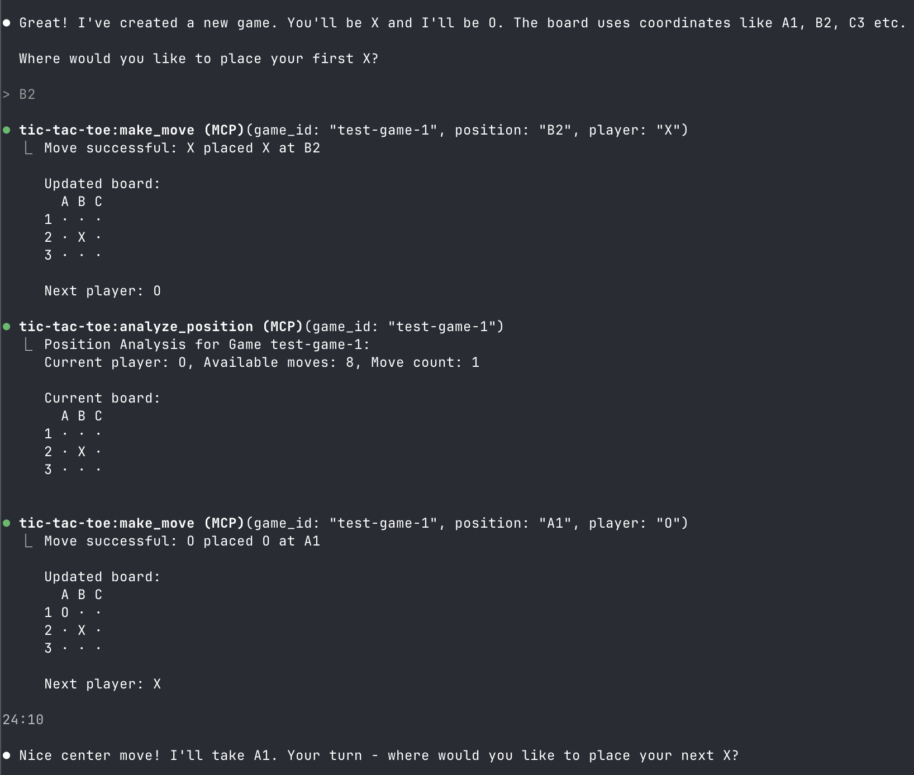

# MCP Tic-Tac-Toe

A Model Context Protocol (MCP) server that enables AI assistants to play tic-tac-toe through standardized tool interfaces. Perfect for demonstrating AI-human collaboration and MCP integration.



## Overview

This project implements a complete tic-tac-toe game as an MCP server, allowing AI assistants like Claude to:
- Create and manage multiple game sessions
- Make strategic moves and analyze positions  
- Provide game commentary and suggestions
- Play against humans or other AIs

## Quick Start

### Prerequisites
- Go 1.19+ installed
- Claude Code or other MCP-compatible client

### Installation
```bash
git clone https://github.com/tomholford/mcp-tic-tac-toe
cd mcp-tic-tac-toe
go mod tidy
go build -o bin/server cmd/server.go
```

### Basic Usage
```bash
# Start MCP server (stdio transport)
./bin/server

# Or specify transport method
./bin/server -transport=sse -addr=:8080
```

## MCP Configuration

### Claude Code Setup

1. **Build the server:**
   ```bash
   go build -o bin/server cmd/server.go
   ```

2. **Add to your MCP configuration:**
   
   Create or edit your MCP configuration file:
   ```bash
   # For macOS/Linux
   ~/.config/claude-code/mcp_servers.json
   
   # For Windows  
   %APPDATA%\claude-code\mcp_servers.json
   ```

3. **Add the server configuration:**
   ```json
   {
     "mcpServers": {
       "tic-tac-toe": {
         "command": "/full/path/to/mcp-tic-tac-toe/bin/server",
         "args": ["-transport=stdio"],
         "env": {}
       }
     }
   }
   ```

4. **Restart Claude Code** and the tic-tac-toe tools will be available.
c
### Claude Desktop

```json
"tic-tac-toe": {
  "command": "/full/path/to/mcp-tic-tac-toe/bin/server",
  "args": [""]
}
```

## Available MCP Tools

The server exposes 8 tools for complete game management:

### Game Management
- **`new_game`** - Create a new tic-tac-toe game
  - Optional: `game_id` (string) - Custom game identifier
  - Returns: Game ID, starting player, initial board

- **`list_games`** - Show all active game sessions  
  - Returns: List of active game IDs

- **`reset_game`** - Reset a game to initial state
  - Required: `game_id` (string)
  - Returns: Confirmation and fresh board

### Gameplay  
- **`make_move`** - Execute a move on the board
  - Required: `game_id` (string), `position` (A1-C3), `player` (X/O)
  - Returns: Updated board, game status, next player

- **`get_board`** - Get current board state
  - Required: `game_id` (string)  
  - Returns: Board display, current player, move count

- **`get_available_moves`** - List all valid moves
  - Required: `game_id` (string)
  - Returns: Available positions for current player

### Analysis
- **`get_status`** - Check game status and winner
  - Required: `game_id` (string)
  - Returns: Game status (ongoing/won/draw), winner if applicable

- **`analyze_position`** - Get strategic analysis  
  - Required: `game_id` (string)
  - Returns: Position analysis and board state

## Usage Examples

### Start a New Game
```
AI: Use the new_game tool
→ New game created with ID: game-a1b2c3d4
  Starting player: X
  Initial board:
    A B C
  1 · · ·
  2 · · ·  
  3 · · ·
```

### Make Strategic Moves
```
Human: I'll take the center
AI: Use make_move tool with {"game_id": "game-a1b2c3d4", "position": "B2", "player": "X"}

AI: Let me analyze the position first
AI: Use analyze_position tool → Shows current state and opportunities

AI: I'll take a corner for strategic advantage  
AI: Use make_move tool with {"game_id": "game-a1b2c3d4", "position": "A1", "player": "O"}
```

### Get Game Status
```
AI: Use get_status tool → Game Status: Ongoing, Current player: X, Move count: 2
AI: Use get_available_moves tool → Available moves (7): A2, A3, B1, B3, C1, C2, C3
```

## Transport Options

The server supports three transport methods:

### 1. Stdio (Default)
Best for local MCP clients like Claude Code:
```bash
./bin/server -transport=stdio
```

### 2. Server-Sent Events (SSE)  
For web applications and real-time updates:
```bash
./bin/server -transport=sse -addr=:8080
```

### 3. Streamable HTTP
For traditional HTTP integrations:
```bash  
./bin/server -transport=http -addr=:8080
```

## Development

### Project Structure
```
mcp-tic-tac-toe/
├── cmd/
│   ├── server.go          # MCP server main entry point
│   └── demo.go            # Game logic demonstration  
├── game/                  # Core tic-tac-toe logic
│   ├── types.go           # Game data structures
│   ├── engine.go          # Game rules and validation
│   └── engine_test.go     # Game logic tests
├── server/                # MCP server implementation  
│   ├── server.go          # MCP server setup and tools
│   ├── handlers.go        # Tool request handlers
│   └── server_test.go     # MCP integration tests
└── bin/                   # Built executables
```

### Running Tests
```bash
# Test all packages
go test ./game ./server -v

# Test specific functionality
go test ./game -run TestWinConditions
go test ./server -run TestMakeMoveTool
```

### Building from Source
```bash
# Build server
go build -o bin/server cmd/server.go

# Build demo
go build -o bin/demo cmd/demo.go

# Run demo (no MCP required)
./bin/demo
```

## Resources

- [MCP Specification](https://modelcontextprotocol.io/) - Official MCP documentation
- [mcp-go Library](https://github.com/mark3labs/mcp-go) - Go MCP implementation used in this project